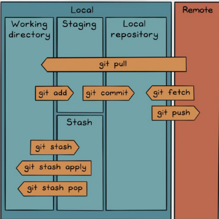
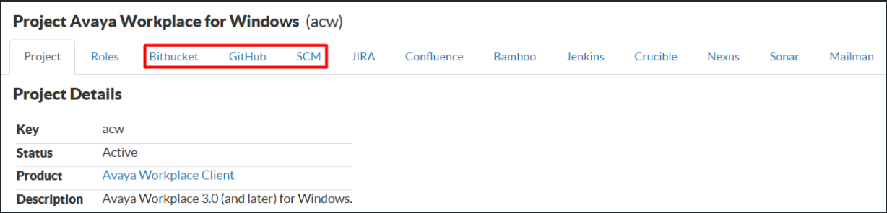

Day 1 git

https://avaya.atlassian.net/wiki/spaces/DLBBEWIKI/pages/2398945477/1-1+Git

# SCM, SVN, and Git

Before diving into Git, it is important to understand the basics of **version control**.

- **SCM (Source Code Management):** SCM is a system that records changes to a file or a set of files over time. It allows you to track history, see who made changes, and go back to older versions if you make a mistake. It is essential for teamwork.
- **SVN (Subversion):** SVN is a **Centralized** Version Control System. This means all the code history is stored on one single central server. Developers must connect to this server to save or download updates. If the central server goes down, no one can save their work.
- **Git:** Git is a **Distributed** Version Control System. Instead of relying on one central server, every developer downloads a complete, local copy of the entire project history to their own computer. It is much faster, allows you to work offline, and is much safer because everyone has a backup.

# Git Architecture

To use Git properly, you need to understand how it handles files.

 

#### The Three Main Areas of Git

Git moves your files through three different "zones" on your computer:

1. **Working Directory:** This is your actual project folder. It is where you create, edit, and delete files.
2. **Staging Area:** This is a waiting room. When you are happy with your changes, you move the files here to prepare them for saving.
3. **Local Repository:** This is Git's database on your computer. When you save the files from the staging area, they are permanently recorded here.

#### Common Git Commands

- `git clone <link>`: Downloads a complete copy of a project from the internet.
- `git status`: Shows you the current state of your files (e.g., which files are new or changed).
- `git add <file>`: Moves a file from the Working Directory to the Staging Area.
- `git commit -m "message"`: Saves the staged files into your Local Repository with a short message describing the changes.
- `git push`: Sends your local saved changes up to a remote server (like GitHub).
- `git pull`: Downloads the newest changes from a remote server to your local computer.
- `git config user.name "name"` & `git config user.email "email"`: Sets your identity. Git requires you to tell it who you are before you can save any changes.

# GitHub, GitLab, Bitbucket, and GitHub Enterprise

People often confuse Git and GitHub. **Git** is the tool you install on your computer. **GitHub** is a website that hosts your Git projects (Remote Repositories) so you can share them with others.

- **GitHub:** The most popular public platform for hosting code. It is the home of millions of open-source projects. Anyone can create a free account and share their code with the world.
- **GitLab:** A platform very similar to GitHub. However, it is famous for its excellent built-in tools that help teams automatically test and deploy their code (CI/CD). Many companies use it for private projects.
- **Bitbucket**: Atlassian’s Git platform, deeply integrated with Jira and Confluence. It provides cloud and self-hosted enterprise editions, ideal for teams using Atlassian toolchains.
- **GitHub Enterprise:** This is the paid, corporate version of GitHub. Large companies use it because it offers advanced security and admin tools. It can even be installed directly on a company's own private servers, keeping their code completely internal.

# Markdown Overview

Markdown is a lightweight, easy-to-learn markup language that uses simple symbols to format plain text. Instead of complex menus, it uses intuitive marks for headings, lists, tables, and code blocks, making it highly readable for both humans and machines. 

Because of its simplicity and wide compatibility, Markdown has become a standard for digital writing. Today, it is also heavily used in the AI world—from writing prompts and defining AI Agent skills to formatting intelligent content.

See syntax in: [Markdown Cheat Sheet | Markdown Guide](https://www.markdownguide.org/cheat-sheet/) 

# Practice

- Sign up for a **GitHub account**.
- Create a repository in your account.
- Install **Git** and **VS Code** on your PC.
- Clone the new repository to your PC and open it via VS Code.
- Write your first Markdown note in VS Code.
- Push it to GitHub once completed.