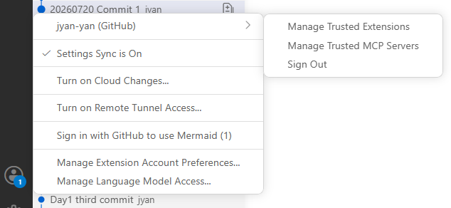
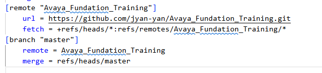
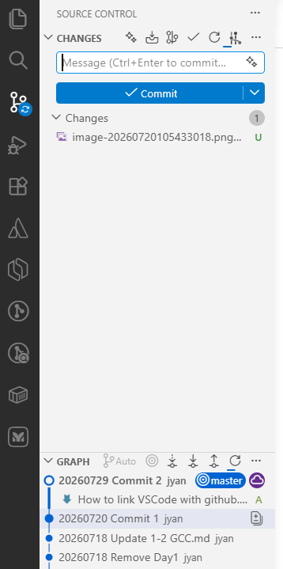

# How to use github in VSCode
1. Install git in Windows. Run command `git --version` to verify

   

2. Install VS Code, run `Ctrl + SHIFT + P` to verify if the VS Code has recognized git.

3. Log into GitHub. Click the Accounts icon, and Sign in to GitHub.

   

4. Check `.git\config` file.

   `remote` shows remote repository list. `branch` shows which remote repository is configured for push.

   

   

5. Clone GitHub (optional). Click  `Ctrl + SHIFT + P`  and search for `Git: Clone` . Input the repository name and location.

6. Git related actions could be found in the `Source Control` tab.

   
