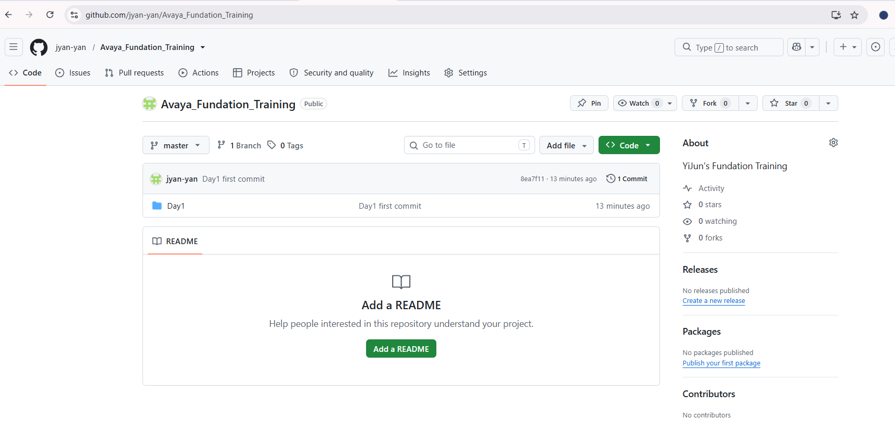
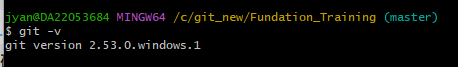

**Date: 20260712**

**Topic: Git, Markdown and Installations**

====

# Practice:

- Sign up for a **GitHub     account**.
- Create a repository     in your account.
- Install **Git** and **VS     Code** on     your PC.
- Clone the new     repository to your PC and open it via VS Code.
- Write your first     Markdown note in VS Code.
- Push it to GitHub     once completed.

- ## *Sign up for a **GitHub  account**.*

2 accounts:

jyan@avaya.com

yanjia_jack@hotmail.com

- ## *Create a repository in your account.*

**Avaya_Fundation_Training** created.

- ## *Install Git and VS Code on your PC.*

1. git installation:

   Download git: https://git-scm.com/

   

2. VS code installation:

   

- ## *Clone the new  repository to your PC and open it via VS Code.*

`$ git clone https://github.com/jyan-yan/Avaya_Fundation_Training.git`

- ## *Write your first  Markdown note in VS Code.*

  - 核心扩展（强烈推荐）

    - ✅ Markdown All in One — 多个便捷功能：目录（TOC）、键盘快捷、按键格式化、折叠、自动完成等。
    - ✅ markdownlint — 语法风格检查，帮助保持一致的 Markdown 风格。
    - ✅ Markdown Preview Enhanced 或 Markdown Preview (built-in + 插件增强) — 支持数学公式、Mermaid、图表和导出 PDF/HTML。
    - ✅ Paste Image（或 Paste Image to Folder）— 直接粘贴剪贴板图片并自动保存到项目目录。
    - ✅ Markdown Table Formatter — 自动对齐/格式化表格。
    - ✅ Code Spell Checker — 拼写检查（可装中英文词典扩展）。
    - ✅ Mermaid Preview（如果你大量画流程图/时序图）

    如何安装：在 VS Code 中按 Ctrl+Shift+X 搜索扩展名并一键安装。

- ## *Push it to GitHub     once completed.*

git push https://github.com/jyan-yan/Avaya_Fundation_training.git master:master

