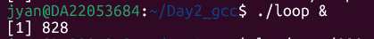
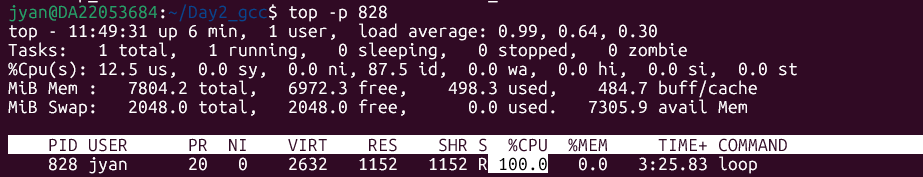
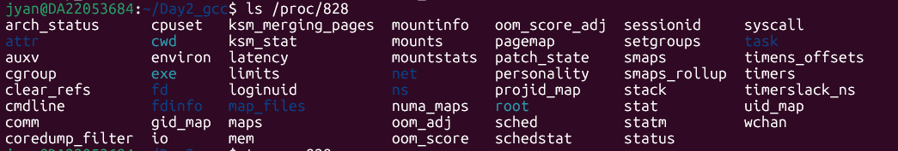

# loop.c Practice

1. **Create loop.c file**

```C
#define LOOP 1 

int main(void) 
{
	while(LOOP); 
}
```

ECC commands

>   -E                       Preprocess only; do not compile, assemble or link.
>   -S                       Compile only; do not assemble or link.
>   -c                       Compile and assemble, but do not link.
>   -o <file>                Place the output into <file>.


2. **Run these commands to see the output of each translation step:**

- `gcc -E loop.c -o loop.i` (Preprocess: creates a huge text file).
- `gcc -S loop.i -o loop.s` (Compile: creates Assembly code).
- `gcc -c loop.s -o loop.o` (Assemble: creates the binary Object file).
- `gcc loop.o -o loop`(Link: creates the final ELF executable).

<u>Result:</u>

**loop.i** : adding # parts and change the LOOP to 1. Preprocessed.

```
jyan@DA22053684:~/Day2_gcc$ cat loop.i

# 0 "loop.c"
# 0 "<built-in>"
# 0 "<command-line>"
# 1 "/usr/include/stdc-predef.h" 1 3 4
# 0 "<command-line>" 2
# 1 "loop.c"

int main(void)
{
 while(1);
}
```

**loop.s** :  Compiled.

```
jyan@DA22053684:~/Day2_gcc$ cat loop.s
        .file   "loop.c"
        .text
        .globl  main
        .type   main, @function
main:
.LFB0:
        .cfi_startproc
        endbr64
        pushq   %rbp                  =============> Create stack frame, %rbp = stack base pointer
        .cfi_def_cfa_offset 16
        .cfi_offset 6, -16
        movq    %rsp, %rbp            =============> Create stack frame, %rsp = stack start pointer
        .cfi_def_cfa_register 6
.L2:              ============> enter a fomular (函数), a tab (标签)
        nop
        jmp     .L2
        .cfi_endproc
.LFE0:
        .size   main, .-main
        .ident  "GCC: (Ubuntu 15.2.0-16ubuntu1) 15.2.0"
        .section        .note.GNU-stack,"",@progbits
        .section        .note.gnu.property,"a"
        .align 8
        .long   1f - 0f
        .long   4f - 1f
        .long   5
0:
        .string "GNU"
1:
        .align 8
        .long   0xc0000002
        .long   3f - 2f
2:
        .long   0x3
3:
        .align 8
4:
```

**loop.o**  Assembled

```
jyan@DA22053684:~/Day2_gcc$ cat loop.o
ELF>�@@

       ��UH����GCC: (Ubuntu 15.2.0-16ubuntu1) 15.2.0GNU�zRx

��                                                        E�C
 loop.cmain .symtab.strtab.shstrtab.text.data.bss.comment.note.GNU-stack.note.gnu.property.rela.eh_frame
                                                                                                        !KK,0K'5rEx]�X@@   �`
Xg
```

**loop**  Executable. ELF

```
jyan@DA22053684:~/Day2_gcc$ cat loop
ELF>@@X6@8@@@ttt��AA   �-�=�= (.>>�PPP$$� � � 0� � �   S�td� � � 0P�td   ,,Q�tdR�td�-�=�=GNU��G��L>Ѕ�@���?t�J/lib64/ld-linux-x86-64.so.2��e�mC _ n "__libc_start_main__cxa_finalizelibc.so.6GLIBC_2.2.5GLIBC_2.34_ITM_deregisterTMCloneTable__gmon_start___ITM_registerTMCloneTable"u␦i ,���8� @�?�?�?�?�?��H�H��/H��t��H���5�/�%�/@���%�/fD��1�I��^H��H���PTE1�1�H�=��s/�f.�H�=�/H��/H9�tH�V/H��t  �����H�=i/H�5b/H)�H��H��?H��H�H��tH�%/H����fD�����=%/u+UH�=/H��t
                    H�=/�)����d�����.]������w�����UH������H�H��(���\,����<���D%����zRx
                                                                                     ����&D$4����FJ
                                                                                                   �?␦9*3$"\����t����
 GNU���GNU �"
4�␦����o�H�
�
 ��    ������o����o���o����o@GCC: (Ubuntu 15.2.0-16ubuntu1) 15.2.0��    �  ��
                                                                             p
                                                                               �3
                                                                                 �I@U�=|
                                                                                         ��=������� ���>� ��?�
44@A @] l@:
           @&q@}
                )
                 �@� �"�        Scrt1.o__abi_tagcrtstuff.cderegister_tm_clones__do_global_dtors_auxcompleted.0__do_global_dtors_aux_fini_array_entryframe_dummy__frame_dummy_init_array_entryloop.c__FRAME_END___DYNAMIC__GNU_EH_FRAME_HDR_GLOBAL_OFFSET_TABLE___libc_start_main@GLIBC_2.34_ITM_deregisterTMCloneTable_edata_fini__data_start__gmon_start____dso_handle_IO_stdin_used_end__bss_startmain__TMC_END___ITM_registerTMCloneTable__cxa_finalize@GLIBC_2.2.5_init.symtab.strtab.shstrtab.note.gnu.build-id.interp.gnu.hash.dynsym.dynstr.gnu.version.gnu.version_r.rela.dyn.init.plt.plt.got.text.fini.rodata.eh_frame_hdr.eh_frame.note.gnu.property.note.ABI-tag.init_array.fini_array.dynamic.data.bss.commentHHH�P���o��
�  �  ,�0 0 �� � �� �  �����>.��?��@@00&80H     �3�I5         ]���o��lv  �00�@@��44
                                                     
```

3. **Run the process**

   Run `./loop &`, running the process in background. The process id is replied.

   

   

   Detailed information about this process could be found in `/proc/<process id>`.

   

4. `ldd loop` **check which the elf file depends (依赖哪些库)**

5. 
