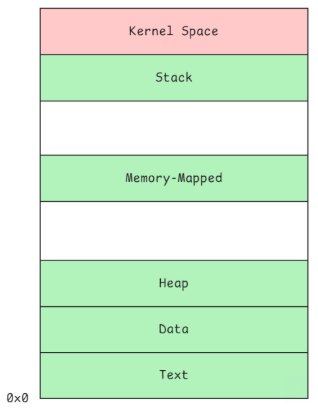
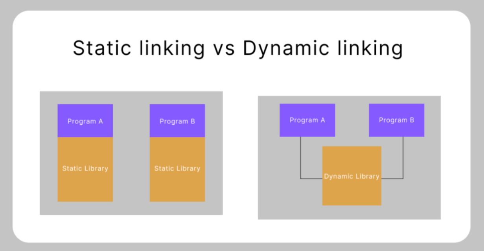

Hi Team,

感谢大家参加今天的training。

为了方便理解，这次大家只需知道：

**1. 源代码(.c)**：纯文本文件，写给程序员看的。

**2. 可执行文件(elf)**：磁盘上的二进制文件，包含了程序执行所需的全部信息（如机器指令、段和节的内存布局等），可以通过readelf查看

**3. 进程**：可执行文件被加载到内存中正在运行的实体

**4. GCC**：一个命令行工具，负责把 C 源码一步步编译、汇编并链接，最终生成可执行的 ELF 文件。
**5. C语言非常重要、Assembly（汇编语言）非常重要**。但不用急，有AI辅助，学中练即可。

另外，回答课上提的几个问题（大多涉及后续topic，和AI聊聊，知道个大概即可）。

**1. 内存布局映射**

ELF 是磁盘上的二进制文件，里面规划好了内存段的布局。内核加载 ELF 并分配虚拟内存地址后，就形成了进程。

通过 cat /proc/<pid>/maps 可以观察其真实的内存分布

Linux 进程内存布局如下：

**2. Linux的启动和内存**

Linux的启动经历 实模式、保护模式和长模式（64位）。从保护模式起可以启用分页，也就是说，现代Linux运行的进程使用的都是虚拟内存。
页表就是用来记录虚拟内存地址与物理内存地址映射关系的数据结构。

**3. 动态库和静态库**

库文件就是一组函数和数据的集合（也包括全局变量，涉及写时复制 COW，可先忽略）。

**动态库（.so, .dll）**：可以被多个进程加载到各自的 Memory-Mapped（内存映射）段，其中只读的代码指令在物理内存中只有一份，由多个进程共享。
**静态库（.a, .lib）**：在编译的链接阶段被直接合并到主程序对应的段中（比如静态库里的代码合并到主程序的 Text段，全局变量合并到 Data段）。

从使用角度看：动态库在程序启动时，需要由运行期的动态链接器（ld.so）进行加载和解析，会略微消耗一些系统资源和启动时间；而静态库则完全没有运行期的这方面开销。
（可以让AI写几个动态库示例，然后用GCC编译，观察）

**4. 汇编语言**

操作系统的核心是 CPU，CPU 工作的本质就是各种指令（比如 MOV、JMP）、寄存器（EAX、ESP、EIP）以及总线的协同配合。
汇编语言就是用来直接编写这些底层交互内容的。但由于不同架构 CPU 的指令集和寄存器完全不同，所以一种汇编语言通常只专用于一种芯片架构（无法跨平台）。
我之前主要写 Intel 芯片（x86/x86-64 架构）的汇编，所以常用 NASM，除此之外，常见的还有微软官方的 MASM 以及 Linux 风格默认的 GAS。

**Best Regards,**

 

**Yijun Liu**