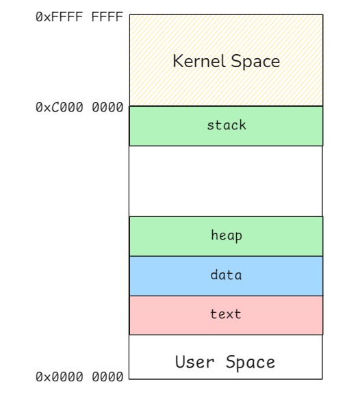
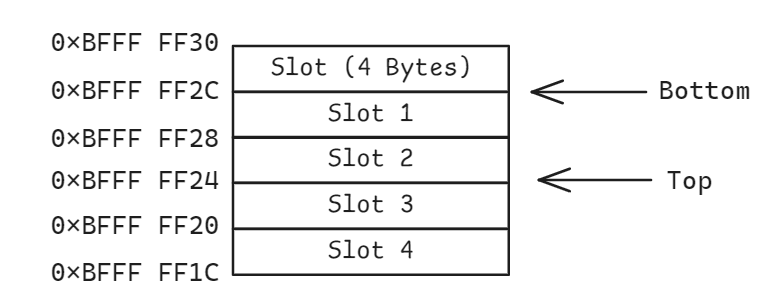

# Stack

The Linux kernel allocates ==a virtual memory== space for each process to ensure isolation, flexibility, and efficient memory management. In a 32-bit system, this virtual memory is divided into distinct sections, each serving a specific purpose:

- **Text Segment**: Contains the program's executable code.
- **Data Segment**: Stores global and static variables.
- **Heap**: Manages dynamically allocated memory using functions like `malloc()` and `free()`.
- **Stack Segment**: Handles function calls, local variables, and maintains the program's execution flow.

The layout in 64-bit systems is similar, but with a significantly larger address space. Later, we will focus on the Stack Segment.

一个C语言程序占用的内存：

- **BSS Segment**: 保存未初始化的全局变量的一段内存区域，静态内存分配。bss是英文Block Started by Symbol的简称。
- **Text Segment:** 存放运行代码和常量，是只读区域。
- **Data Segment:** 存放赋值的全局变量和static声明的局部变量，静态内存分配。
- **Heap**: 用于存放数据，可由malloc()和free()扩容和缩容。地址被使用后，内部数据不会被删除。Stack空间有限（几MB）而Heap可以占用几乎所有可用物理内存。
- **Stack:** 临时的局部变量。{}中定义的变量，但是static的部分还是要存入Data Segment的。函数调用时，函数参数也会被压入Stack中。LIFO的方式。可以把栈堪称一个寄存， 交换临时数据的内存区。

问题：

1. 一个进程如果有多线程，Stack中如何通过LIFO的形式来处理？==A：每个线程有自己的stack。所有子线程公用主进程的内存空间。==
2. Stack中直接存储数据，还是存储数据所在内存位置的指针？Data和Text部分呢？在Data中，int, float等基本数据类型是直接保存，其他保存指向Heap内存的指针/引用地址。Stack中，基本数据类型，如int, float，char，bool等，直接存变量，其他类型存指针
3. Stack中的数据在被程序调用的时候如何来寻址？

## Stack layout

The stack segment is a memory structure that follows a **last-in-first-out (LIFO)** order, where data is added to and removed from the "top" of the stack.

In 32-bit x86 architectures, the stack is divided into basic units called slots, each 4 bytes in size.

On 64-bit x86-64 architectures, the slot size is expanded to 8 bytes to accommodate the larger word size.

