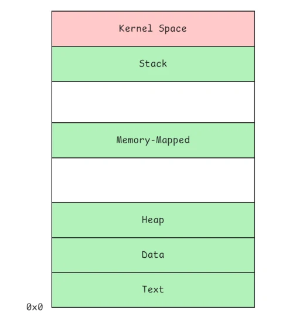

# 1-4 MM

https://avaya.atlassian.net/wiki/spaces/DLBBEWIKI/pages/2448850963/1-4+MM


# Memory

**Memory** is a high-speed storage component where **every unique address represents exactly one byte (8 bits) of data**.

**Physical Memory** is the total address space of all hardware devices combined, such as the RAM stick, BIOS ROM, and MMIO (Memory-Mapped I/O). The CPU sees these physical addresses as a continuous line of numbers, but the actual usable memory is cut into pieces.

**Virtual Memory** was invented to provide memory isolation (security) and simplify address management. Today, all PCs and servers use it. For ordinary programs (processes), every memory address they use is a virtual address. Virtual memory gives each process the illusion of owning the entire address space (for example, a full 4GB for a 32-bit system). To make this work, the system relies on page tables, the CPU's MMU, and the TLB cache.

## Process Virtual Layout

When a process is created, the Linux kernel sets up its virtual memory based on the ELF file. The process memory layout is divided into **Kernel Space** (shared by all processes) and **User Space** (dedicated to this specific process).



The User Space contains several key segments:

- **Text (.text, .rodata)**: Stores the compiled, executable machine code and read-only constants.
- **Data (.data, .bss)**: Stores initialized and uninitialized global variables.
- **Heap**: Used for dynamic memory allocation (via `brk`).
- **Memory-Mapped Region**: Used for loading shared libraries and huge files (via `mmap`).
- **Stack**: Stores local variables and temporary function data.

You can check a running process's real-time address layout by reading `/proc/<pid>/maps`.

From this, you can see that the **C language is very simple: it only has Functions (Text) and Variables/Constants (Data)**.

## Memory Management

In Kernel, a process (`struct task_struct`) manages its unique virtual memory space via `struct mm_struct`:

```C
// https://elixir.bootlin.com/linux/v4.18/source/include/linux/sched.h#L593 
struct task_struct {
	struct mm_struct	*mm;  	
	struct files_struct *files; 
} 

// https://elixir.bootlin.com/linux/v4.18/source/include/linux/mm_types.h#L337 
struct mm_struct {  	
    struct vm_area_struct *mmap;		/* list of VMAs */  	
    pgd_t * pgd;  	
    atomic_t mm_users; 
    unsigned long start_code, end_code, start_data, end_data; 
    unsigned long start_brk, brk, start_stack; 
}
```

# Library Call

A **system call** allows a user process to switch into kernel space to execute kernel functions. However, this transition incurs significant performance overhead. To minimize these expensive context switches, Linux provides standard **library calls** (like `malloc()` and `free()` in `man 3`) that act as a user-space caching layer, reducing direct interactions with the kernel.

Under the hood, `malloc()` dynamically delegates tasks to the underlying **system calls** based on the request size:

- **Small Requests (< 128 KB):** `malloc()` extends the process heap boundary by invoking the `brk()` system call.
- **Large Requests (>= 128 KB):** `malloc()` allocates an independent virtual memory region entirely outside the heap by invoking the `mmap()` system call.

## Simulating a Memory Leak & OOM

A **memory leak** occurs when a process keeps allocating memory without calling `free()`. As a result, the process drains the system resources continuously.

Below is a C program that simulates a severe memory leak, which will eventually trigger an **OOM (Out of Memory)** crash:

```C
#include <stdio.h> 
#include <stdlib.h> 
#include <unistd.h> 

int main() {    
	int loop_count = 0;    
	
	while (1) {        
		char *ptr = (char *)malloc(100 * 1024); 	
		for (int i = 0; i < 100 * 1024; i++) {            
			ptr[i] = 'A';        
		}        
		loop_count++; 	
		if (loop_count % 1024 == 0) { 		
			printf("Leaked: %d00 MB total\n", loop_count/1024); 	
		}        
		usleep(1000);    
	}    
	
	return 0; 
}
```

When **physical memory** and **swap space** are completely full, the Linux kernel will trigger the **OOM Killer** to save the system. It selects the biggest memory consumer and terminates it with a SIGKILL signal.

You can find the crash details in the message logs:

```Log
Jul 17 09:37:28 sql47 kernel: oom-kill:constraint=CONSTRAINT_NONE,nodemask=(null),cpuset=/,mems_allowed=0,global_oom,task_memcg=/user.slice/user-1000.slice/session-32.scope,task=a.out,pid=21070,uid=1000 
Jul 17 09:37:28 sql47 kernel: Out of memory: Killed process 21070 (a.out) total-vm:3133444kB, anon-rss:1585600kB, file-rss:0kB, shmem-rss:0kB, UID:1000 pgtables:6176kB oom_score_adj:0
```

# Practice

1. Understand basic memory concepts and master the process memory layout.
2. Explore the structure of `mm_struct` and analyze memory allocation via `/proc/<pid>/maps`.
3. Try library calls (`malloc`/`free`) and their underlying system calls (`brk`/`mmap`).
4. Implement a memory leak example in C and monitor its behavior using `top`.
5. Summarize your learnings into technical notes, and push both the code and notes to GitHub.