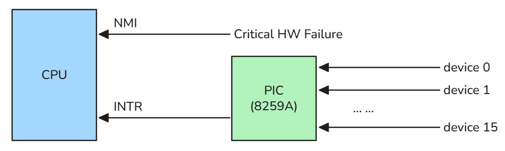
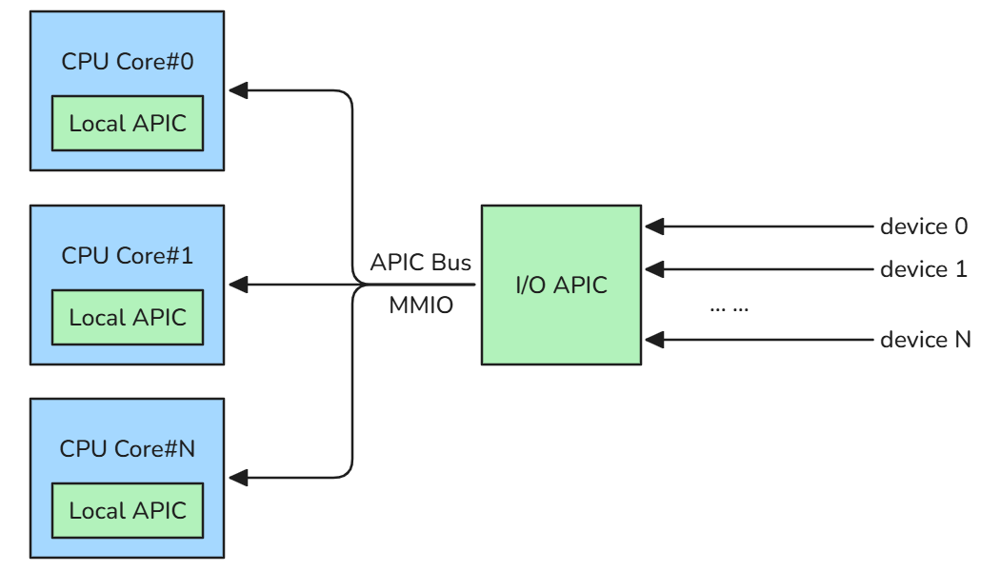

# 1-6 Signal


# Signal

A Signal in Linux is an asynchronous notification mechanism used by the operating system or one process to inform another process that a specific event has occurred. Acting like a software interrupt, signals force a process to temporarily pause its execution, handle the event, and then resume normal operations.

## Interrupt

For a better understanding, it is helpful to briefly review the concept of interrupt. Interrupts are the mechanism by which a system immediately responds to urgent, real-time events, pausing the CPU's current task to address something more critical.

At the lowest level, interruptions are categorized into two main types:

### Hard Interrupt

Hardware interrupts are physical electrical signals generated by external devices (e.g., a network card receiving a packet, or a disk drive completing a read operation). They are asynchronous and can occur at any time, preempting the currently running CPU task.

These signals go directly to the CPU's hardware interrupt controller. The CPU immediately stops what it is doing, saves its state, and jumps to the kernel's Interrupt Service Routine (ISR) to handle the hardware event.

#### PIC Architecture



#### APIC Architecture




### Soft Interrupt

When a program makes a System Call (like requesting to read a file), or executes an illegal operation (like dividing by zero or accessing invalid memory), it triggers a software interrupt. This forces the CPU to switch from User Mode to Kernel Mode so the OS can safely execute the request or handle the error.

## Linux Signal

Building on the concept of interrupts, a **Linux Signal** serves as a higher-level "software interrupt" managed entirely by the operating system. While hardware interrupts notify the CPU of external hardware events, signals notify a user-space process of events triggered by the kernel, hardware exceptions, or other processes.

When a signal is sent to a target process, the kernel records it in the process's data structure (`task_struct`) rather than immediately altering execution flow at the hardware level. The process then handles the signal at specific kernel-to-user execution boundaries.

### Signal Lifecycle

A Linux signal transitions through three primary states during its execution flow:

- **Generated**: The trigger phase. A signal is generated by a hardware exception (e.g., page fault, divide-by-zero), a terminal keyboard shortcut (e.g., `Ctrl+C`), or an explicit system call (e.g., `kill()`, `raise()`).
- **Pending**: The kernel records the incoming signal by updating the target thread's `task_struct`. Specifically, it sets the corresponding bit in the process's `pending` bitmask and flags the thread with `TIF_SIGPENDING`.
  - **Blocked Signals**: If the signal is in the thread's `blocked` mask, it stays in the `pending` bitmask, but `TIF_SIGPENDING` is not set.
  - **Unblocked Signals**: If unblocked, the kernel sets the `TIF_SIGPENDING` flag to alert the CPU.
- **Delivered**: The kernel delivers and processes the signal. It either executes the default action (such as process termination or core dump), ignores the signal, or transfers execution flow to a user-defined signal handler.

A common misconception is that signals are delivered and processed at arbitrary CPU cycles. In reality, signal evaluation and delivery happen at a specific boundary: **when the CPU transitions from Kernel Mode back to User Mode** (e.g., when returning from a system call or an interrupt).

#### Common Signals Reference

Below are some of the most frequently encountered signals (for a complete list, run `man 7 signal` in your terminal):

- `SIGINT` (Signal 2 / Ctrl+C): Interrupts a running process from the terminal.
- `SIGKILL` (Signal 9): Forces a process to terminate immediately. This signal is handled directly by the kernel and cannot be caught, blocked, or ignored.
- `SIGSEGV` (Signal 11): Indicates a segmentation fault, which occurs when a process attempts to access an invalid or unauthorized memory address.

#### Core Attributes (Thread-Private State)

```c
// https://elixir.bootlin.com/linux/v4.18/source/include/linux/sched.h#L593 
struct task_struct {    
    sigset_t            blocked;        /* Mask of blocked signals; these will not be delivered until unblocked */    
    sigset_t            real_blocked;   /* Temporary mask used by syscalls like sigsuspend() to save the original mask */    
    struct sigpending   pending;        /* Structure containing the private queue of pending signals for this thread */ 
};
```

### Signal Handling

Once a signal transitions to the **Delivered** state, the target process must execute its associated action. This action is known as the signal's **disposition**.

A process can configure the disposition of any given signal to follow one of three execution paths:

- **Default Action (**`SIG_DFL`): The kernel executes the system-defined default behavior for the signal. Depending on the signal, this typically results in process termination (with or without a core dump), process suspension (e.g., `SIGSTOP`), or no action at all (e.g., `SIGCHLD`).
- **Ignore (**`SIG_IGN`): The kernel silently discards the signal. The target process remains entirely unaware that the signal was ever generated. Note that `SIGKILL` and `SIGSTOP` cannot be ignored.
- **Custom Handler (Catching)**: The process overrides the default behavior by registering a custom callback function. When the signal is delivered, the kernel alters the user-space stack frame to force execution into this custom handler.

#### Core Attributes (Shared Process State)

```c
// https://elixir.bootlin.com/linux/v4.18/source/include/linux/sched.h#L593 
struct task_struct {    
    struct signal_struct  *signal;    /* Shared signal state and queue for the entire thread group (process) */    
    struct sighand_struct *sighand;   /* Shared signal handlers and disposition table for the entire thread group */ 
};
```

## System Calls and Library Functions

The signal handling mechanism in the example relies on the following interfaces:

- `sigaction()`: A system call that configures and registers how a process responds to specific signals. It accepts a `struct sigaction` containing a pointer to the handler function (`sa_handler`), a signal mask (`sa_mask`), and configuration flags (`sa_flags`). At the kernel level, it updates the disposition table in the thread group's shared `sighand_struct`.
- `sigemptyset()`: A C library function that initializes a `sigset_t` signal set structure to zero, clearing all signals from the set. In this example, it populates `sa.sa_mask` in user memory to ensure no additional signals are blocked while executing the `handle_signal` callback.

```C
#include <stdio.h>
#include <stdlib.h>
#include <unistd.h>
#include <signal.h>

void handle_signal(int sig) {
    switch (sig) {
        case SIGINT:
            write(STDOUT_FILENO, "\nCaptured SIGINT (Ctrl+C)\n", 26);
            break;
        case SIGQUIT:
            write(STDOUT_FILENO, "\nCaptured SIGQUIT (Ctrl+\\)\n", 28);
            break;
        case SIGTSTP:
            write(STDOUT_FILENO, "\nCaptured SIGTSTP (Ctrl+Z). Exiting...\n", 39);
            exit(0);
        default:
            break;
    }
}

int main() {
    printf("PID: %d (Ctrl+C: SIGINT, Ctrl+\\: SIGQUIT, Ctrl+Z: Exit)\n", getpid());

    // Configure sigaction struct
    // sa_handler sets the signal disposition:
    // - Custom callback function (e.g., handle_signal)
    // - SIG_IGN (ignore signal)
    // - SIG_DFL (restore default action)
    struct sigaction sa;
    sa.sa_handler = handle_signal;
    sigemptyset(&sa.sa_mask);
    sa.sa_flags = 0;

    // Register signal handlers
    sigaction(SIGINT,  &sa, NULL);
    sigaction(SIGQUIT, &sa, NULL);
    sigaction(SIGTSTP, &sa, NULL);

    while (1) {
        sleep(1);
    }

    return 0;
}
```


### Tracing the Signal Lifecycle

```shell
$ strace -p [pid]
# 1. PENDING: Signal generated (Ctrl+C). Kernel interrupts blocking syscall and marks SIGINT pending
nanosleep({tv_sec=1, tv_nsec=0}, {tv_sec=0, tv_nsec=678014364}) = ? ERESTART_RESTARTBLOCK (Interrupted by signal)

# 2. DELIVERED: CPU switches to user space; kernel invokes the registered signal handler
--- SIGINT {si_signo=SIGINT, si_code=SI_KERNEL} ---

# 3. HANDLER EXECUTION: Custom signal handler runs user-space logic
write(1, "\nCaptured SIGINT (Ctrl+C)\n", 26) = 26

# 4. RESTORATION: Handler completes; rt_sigreturn restores previous CPU context and signal mask
rt_sigreturn({mask=[]})                 = -1 EINTR (Interrupted system call)

# 5. RESUME: Main loop execution resumes normal flow
nanosleep({tv_sec=1, tv_nsec=0}, 0x7ffcfcea7aa0) = 0
```

## Practice

1. Differentiate between interrupts and signals, understanding how signals act as higher-level software interrupts delivered at the kernel-to-user transition boundary.
2. Explore `struct task_struct` fields related to signals, contrasting process-wide shared states (`signal`, `sighand`) with thread-private states (`pending`, `blocked`).
3. Trace the complete signal lifecycle using `strace`.
4. Implement the signal handling example in C to intercept `SIGINT`, `SIGQUIT`, and `SIGTSTP`.
5. Summarize your learnings into technical notes, and push both the code and notes to GitHub.